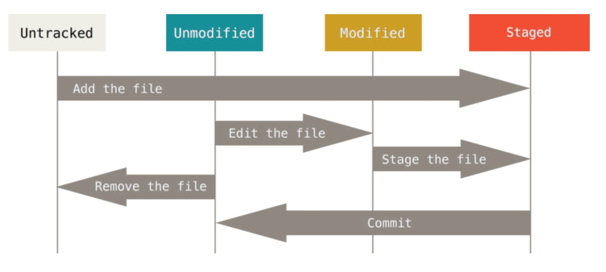

*********
Pro Git
*********

*By Scott Chacon & Ben Straub*

.. contents:: Table of Contents
   :depth: 4

0. AngularJS Git Commit Message Conventions_
============================================
.. _Conventions:  https://docs.google.com/document/d/1QrDFcIiPjSLDn3EL15IJygNPiHORgU1_OOAqWjiDU5Y/edit#heading=h.greljkmo14y0

0.1 Goals
---------
* allow generating CHANGELOG.md by script
* allow ignoring commits by git bisect (not important commits like formatting
* provide better information when browsing the history

0.1.1 Generate CHANGELOG.md
^^^^^^^^^^^^^^^^^^^^^^^^^^^
We use these three sections in changelog: new features, bug fixes, breaking changes. This list could be generated by script when doing a release. Along with links to related commits. Of course you can edit this change log before actual release, but it could generate the skeleton.

*List of all subjects (first lines in commit message) since last release*:

.. code-block:: bash

    git log <last tag> HEAD --pretty=format:%s

*New features in this release*

.. code-block:: bash

    git log <last release> HEAD --grep feature

0.1.2 Recognize unimportant commits
^^^^^^^^^^^^^^^^^^^^^^^^^^^^^^^^^^^
These are formatting changes (adding/removing spaces/empty lines, indentation), missing semi colons, comments. So when you are looking for some change, you can ignore these commits - no logic change inside this commit.

When bisecting, you can ignore these by:

.. code-block:: bash

    git bisect skip $(git rev-list --grep irrelevant <good place> HEAD)

0.1.3 Provide more information when browsing the history
^^^^^^^^^^^^^^^^^^^^^^^^^^^^^^^^^^^^^^^^^^^^^^^^^^^^^^^^
This would add kinda “context” information. Look at these messages (taken from last few angular’s commits):

* Fix small typo in docs widget (tutorial instructions)
* Fix test for scenario.Application - should remove old iframe
* docs - various doc fixes
* docs - stripping extra new lines
* Replaced double line break with single when text is fetched from Google
* Added support for properties in documentation

0.2 Commit Convention
-----------------------------------
So Standard format of the commit message should like this:

* <type>(<scope>): <subject>
* <BLANK LINE>
* <body>
* <BLANK LINE>
* <footer>

.. note:: Any line of the commit message cannot be longer 100 characters! This allows the message to be easier to read on github as well as in various git tools.

A commit message consists of a header, a body and a footer, separated by a blank line.

0.2.1 Revert
^^^^^^^^^^^^

If the commit reverts a previous commit, its header should begin with `revert: `, followed by the header of the reverted commit. In the body it should say: `This reverts commit <hash>.`, where the hash is the SHA of the commit being reverted.

0.2.2 Message Header
^^^^^^^^^^^^^^^^^^^^
The message header is a single line that contains succinct description of the change containing a type, an optional scope and a subject.

**Allowed <type>**, which describes the kind of change that this commit is providing, contains:

* feat (feature)
* fix (bug fix)
* docs (documentation)
* style (formatting, missing semi colons, …)
* refactor
* test (when adding missing tests)
* chore (maintain)

**Allowed <scope>** can be anything specifying place of the commit change. For example $location, $browser, $compile, $rootScope, ngHref, ngClick, ngView, etc...,

**<subject>** is a very short description of the change.

* use imperative, present tense: “change” not “changed” nor “changes”
* don't capitalize first letter
* no dot (.) at the end

0.2.3 Message Body
^^^^^^^^^^^^^^^^^^

* just as in <subject> use imperative, present tense: “change” not “changed” nor “changes”
* includes motivation for the change and contrasts with previous behavior

0.2.4 Message Footer
^^^^^^^^^^^^^^^^^^^^
- **Breaking changes**

All breaking changes have to be mentioned as a breaking change block in the footer, which should start with the word BREAKING CHANGE: with a space or two newlines. The rest of the commit message is then the description of the change, justification and migration notes.

.. code-block:: bash

    BREAKING CHANGE: isolate scope bindings definition has changed and the inject option for the directive controller injection was removed.

    To migrate the code follow the example below:

    Before:

    scope: {
      myAttr: 'attribute',
      myBind: 'bind',
      myExpression: 'expression',
      myEval: 'evaluate',
      myAccessor: 'accessor'
    }

    After:

    scope: {
      myAttr: '@',
      myBind: '@',
      myExpression: '&',
      // myEval - usually not useful, but in cases where the expression is assignable, you can use '='
      myAccessor: '=' // in directive's template change myAccessor() to myAccessor
    }

The removed `inject` wasn't generaly useful for directives so there should be no code using it.

- **Referencing issues**

Closed bugs should be listed on a separate line in the footer prefixed with "Closes" keyword like this:

.. code-block:: shell

    Closes #234

or in case of multiple issues:

.. code-block:: shell

    Closes #123, #245, #992

0.3 Examples
------------
.. code-block:: shell

    feat($browser): onUrlChange event (popstate/hashchange/polling)

    Added new event to $browser:
    - forward popstate event if available
    - forward hashchange event if popstate not available
    - do polling when neither popstate nor hashchange available

    Breaks $browser.onHashChange, which was removed (use onUrlChange instead)

.. code-block:: shell

    fix($compile): couple of unit tests for IE9

    Older IEs serialize html uppercased, but IE9 does not...
    Would be better to expect case insensitive, unfortunately jasmine does
    not allow to user regexps for throw expectations.

    Closes #392
    Breaks foo.bar api, foo.baz should be used instead

.. code-block:: bash

    feat(directive): ng:disabled, ng:checked, ng:multiple, ng:readonly, ng:selected

    New directives for proper binding these attributes in older browsers (IE).
    Added coresponding description, live examples and e2e tests.

    Closes #351

.. code-block:: bash

    style($location): add couple of missing semi colons

.. code-block:: bash

    docs(guide): updated fixed docs from Google Docs

    Couple of typos fixed:
    - indentation
    - batchLogbatchLog -> batchLog
    - start periodic checking
    - missing brace

.. code-block:: bash

    feat($compile): simplify isolate scope bindings

    Changed the isolate scope binding options to:
      - @attr - attribute binding (including interpolation)
      - =model - by-directional model binding
      - &expr - expression execution binding

    This change simplifies the terminology as well as
    number of choices available to the developer. It
    also supports local name aliasing from the parent.

    BREAKING CHANGE: isolate scope bindings definition has changed and
    the inject option for the directive controller injection was removed.

    To migrate the code follow the example below:

    Before:

    scope: {
      myAttr: 'attribute',
      myBind: 'bind',
      myExpression: 'expression',
      myEval: 'evaluate',
      myAccessor: 'accessor'
    }

    After:

    scope: {
      myAttr: '@',
      myBind: '@',
      myExpression: '&',
      // myEval - usually not useful, but in cases where the expression is assignable, you can use '='
      myAccessor: '=' // in directive's template change myAccessor() to myAccessor
    }

0.4 `Commit Tool - Commitizen <https://github.com/commitizen/cz-cli>`_
-----------------------------------------------------------------------
Use Committzen node module to help use AngularJS's commit message convention also known as conventional-changelog. Installation and configuration are:

.. code-block:: shell

      npm install commitizen -g    # install committzen module globally
      cd project && npm init  # entry project directory and initiate package.json file
      commitizen init cz-conventional-changelog --save-dev --save-exact  # initialize the project to use cz-conventional-changelog adapter
      git cz  # use the command to commit

1. Chapter 1 Getting Started
=============================

* **Local Version Control Systems**. One of the more popular VCS tools was a system called RCS, which re-create what any file looked like at any point in time by adding up all the patches.

* **Centralized Version Control Systems**. These systems, such as CVS, Subversion, and Perforce, have a single server that contains all the versioned files, and a number of clients that check out files from that central place.

* **Distributed Version Control Systems**. In a DVCS (such as Git, Mercurial, Bazaar or Darcs), clients don’t just check out the latest snapshot of the files: they fully mirror the repository. leon is here to demo leon  a.

Git thinks of its data more like a set of snapshots of a miniature filesystem. Every time you commit, or save the state of your project in Git, it basically takes a picture of what all your files look like at that moment and stores a reference to that snapshot. The mechanism that Git uses for checksumming is called a SHA-1 hash.

Git has three main states that your files can reside in: committed, modified, and staged.

* Commited: means that the data is safely stored in your local database
* Modified: means that you have changed the file but have not committed it to your database yet
* Staged: means that you have marked a modified file in its current version to go intoyour next commit snapshot.

**The staging area is a file, generally contained in your Git directory, that stores information about what will go into your next commit. It’s sometimes referred to as the “index”, but it’s also common to refer to it as the staging area.**

git config file can be stored in three different places, each level overrides values in the previous level:

#. /etc/gitconfig file: Contains values for every user on the system and all their repositories. If you pass the option --system to git config, it reads and writes from this file specifically.
#. ~/.gitconfig or ~/.config/git/config file: Specific to your user. You can make Git read and write to this file specifically by passing the --global option.
#. config file in the Git directory (that is, .git/config) of whatever repository you’re currently using: Specific to that single repository.

Sample git config commands.

.. code-block:: shell

    git config user.name "Leon Lee"
    git config user.email "lee.leon0519@gmail.com"
    git config core.editor "emacs -nw"
    git config color.status auto
    git help config   # For more information

2. Chapter 2 Git Basics
=======================

In git, files catogarized as tracked and untracked. For tracked files, they may also in unmodified, modified, and staged status. The following picture shows the lifecycle of a git file.

.. code-block:: shell

    git init  # create .git directory and start tracking files of a project
    git clone https://github.com/libgit2/libgit2 mylibgit  # clone a repo and rename it
    git status -s # short status
    git diff # compare the file that is in your working directory with that is in your staging area
    git diff --staged  # compares your staged changes to your last commit
    git diff --cached  # see what you’ve staged so far, same with --staged
    git rm log/\*.log  # remove all .log files in log directory
    git rm --cached filename # remove somefile from stage area and make it as untracked
    git mv README.md README  # Rename a file
    git log # show commit log
    git commit --amend  # replace former commit with the current one
    git reset HEAD somefile  # unstage a file
    git checkout -- somefile  # Discard changes of a file
    git remote -v # show remote repos (repos on Internet)
    git remote add [shortname] [url] # Add a remote repo with a shortname
    git remote rename a  b # renma a remote from a to b
    git remote rm a # remove a remote
    git fetch repo  # get remote repo data but not merge
    git pull repo # ger remote repo and merge
    git push [remote-name] [branch-name] # push local branch to remote repo
    git tag  # list all tags
    git tag -a v1.4 -m 'my version 1.4'  # Add an anotated tag
    git tag v1.4-lw  # Add a lightweight tag
    git tag -a v1.2 9fceb02  # add a tag for a former commit
    git push origin [tagname] # git push does not push tag in default, add a tag behind if you desire
    git push origin --tags  # push all tags
    git checkout -b version2 v2.0.0  # checking out a tag by creating a new branch

**git clone** has an important distinction – instead of getting just a working copy, Git receives a full copy of nearly all data that the server has.

**git add** is a multipurpose command – you use it to begin tracking new files, to stage files, and to do other things like marking merge-conflicted files as resolved.

**git status** There are two columns to the output - the left hand column indicates that the file is staged and the right hand column indicates that it’s modified.

**gitignore file** can support regular expression. Comprehensive ignore files can be found on `github/gitignore <http://github.com/github/gitignore>`_

**git rm** will automatically stage the file deleted compared with "rm filename" command which will not. Support regular expression.

**git log -p -2** shows the lastest 2 commit log in diff detail, also **"--since"** and **"--until"** options can be used to deal with time, **"---stat"** option print diff abbreviation, **"--format"** option prints customised output, **"--graph"** option show nice ASCII graph log, **"-S"** option takes a string and onlyshows the commits that introduced a change to the code that added or removed that string, **"--grep"** option lets you search for keywords in the commit messages.

Git uses two main types of tags: **lightweight** and **annotated**. A lightweight tag is very much like a branch that doesn’t change – it’s just a pointer to a specific commit. Annotated tags, however, are stored as full objects in the Git database. **Annotated** tag is recommended.

As you can tell, Git simply replaces the new command with whatever you alias it for. However, maybe you want to run an external command, rather than a Git subcommand. In that case, you start the command with a ! character. This is useful if you write your own tools that work with a Git repository. We can demonstrate by aliasing git visual to run gitk:

.. code-block:: shell

    git config --global alias.visual '!gitk'

3. Chapter 3 Git Branching
==========================
