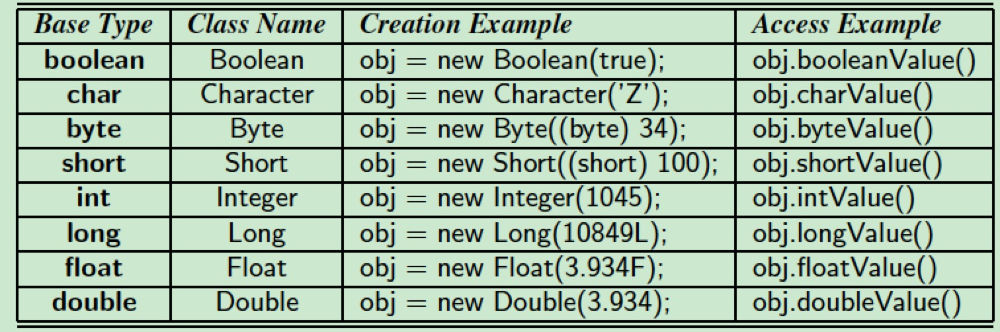

****
Java
****
From Book "Data Structure and Algorithms in Java (Six Edition)"

.. contents:: Table of Contents
    :depth: 4

1. Java Primer
==============

1.1 Getting Started
-------------------

- //： Inline comment
- /* \*/: Block comment

Base (Primitive) types:

- boolean
- chart: 16-bit Unicode character
- byte: 8-bit signed two’s complement integer
- short: 16-bit signed two’s complement integer
- int: 32-bit signed two’s complement integer
- long: 64-bit signed two’s complement integer
- float: 32-bit floating-point number
- double: 64-bit floating-point number

Default integer type is "int", default number type is double.

A nice feature of Java is that when base-type variables are declared as
instance variables of a class (see next section), Java ensures initial
default values if not explicitly initialized. In particular, all numeric
types are initialized to zero, a boolean is initialized to false, and a
character is initialized to the null character by default.

1.2 Classes and Objects
-----------------------

Instance variables can be a base type ot any class type (also called a
reference type).

- accessor method: class method not changing instance variables
- update method: class method changing instance variables
- constructor: always share the same name of as its class

**The Dot Operator:**

- A method name combined with the number and types of its parameters is called a method's signature.

- There can be many references to the same object.

**Defining a Class:**

- public class modifier: all classes may access the defined aspect
- In java, each public class must be defined in a separate file named classname.java, where "classname" is the name of the class.
- protected class modifier: access to the defined aspect is only granted to the following groups of classes, subclasses and classes belong to the same package
- private class modifier: access to a defined member of a class be granted only to code within that class
- If no explict access control modifier is given, he defined aspect has "package-private" level, allowing other classes in the same package to have access
- static: define variable or methods in class. static variable is associated with class as a whole, storing global information about a class. Static method is associated with class itself, which means the method is not invoked on a particular instance of the class using the traditional dot notation, it is invoked using the name of the class as qualifier (E.g., Math.sqrt(2))
- abstract: declare method, whose signature is provided but without an implementation of the method body.
- A class with one or more abstract methods must also be formally declared as abstract, because it is essentially incomplete.
- final: a variable with final modifier can be initialized as part of that declaration, but can never again be assigned a new value. A final method can't be overridden by a subclass, and a final class can't even be sub-classed.

**Declaring Instance Variables format:** [modifier] type identifier = initialValue

**Declaring Methods format:** [modifier] returnType methodName(type1 param1, ...) {}

Java methods can return only one value. To return multiple values in Java, we should instead combine all the values we want to return in a compund object, whose instance variables include all the values we want to return, and then return a reference to that compound object. In addition, we can change the internal state of an object that is passed to a method as another way of "returning" multiple results.

**Declaring Constructors:**

- cant't be static, abstract, or final, can only be public, protected, or private
- name of constructor must be the same with class name
- no return type declaration, nor return value (even void)
- A class can have many constructors, but each must have a different signature
- default constructor, zero arguments and all instance variables initialized to their default values

**The Keyword this:**

- With the body of a non-static method, keyword "this" is automatically defined as a reference to the instance upon which the method was invoked.
- "this" can use to invoke other constructors

**The main Method:**

- The primary control for an application in Java must begin in some class with the execution of a special method named main, defined public static void main(String[] args) { }

1.3 Strings, Wrappers, Array, and Enum Types
--------------------------------------------
**String class**:

- A string instance represents a sequence of zero or more characters
- character indexing: from 0 to n-1, n is the length of the string, e.g. String.charAt(9)
- concatenation (combing string), e.g. "A" + "B", it does create a new string, copying all characters of the existing string in the process, time consuming
- String class instance is immutable, once the instance is created and initialized, the value of the instance cannot be changed.
- String is reference type, so the String variable can be reassigned to anther String instance.

**StringBuilder class:**

- mutable version of string

**Wrapper Types:**

- Java defines a wrapper class for each base type
- Automatic Boxing and Unboxing: converting between base types and their wrapper types

**Arrays:**

- array elements: from 0 to n-1, n is the array length, e.g. a[k]
- variables of an array type are reference variables, e.g. int[] primes = {1, 2, 3} or new int[3]
- When arrays are created using the new operator, all of their elements are automatically assigned the default value for the element type

**Enum Types:**

- types that are only allowed to take on values that come from a specified set of names
- e.g. public enum Day {MON, TUE, WED, THU, FRI, SAT, SUN}
- modifier can be blank, public, protected, or private, name values are usually capitalized.

1.4 Expressions
---------------
**Literals:**

- A literal is any “constant” value that can be used in an assignment or other expression.

**Operators:**

- ++i or i++ enabled
- !, &&, || for boolean values
- bitwise operators, ~, &, |, ~, <<, >>, >>>
- Operators on the same line are evaluated in left-to-right order (except for assignment and prefix operations, which are evaluated in right-to-left order)

**Type Conversions:**
- explict casting: (type) exp
- implict casting: you can perform a widening cast (int to double) without use of casting operator
- Incidentally, there is one situation in Java when only implicit casting is allowed, and that is in string concatenation.

1.5 Control Flow
----------------

.. code-block:: java

    if () {
        body
    }
    else if {
        body
    }
    else {
        body
    }

.. code-block:: java

    switch(d) {
        case MON:
            statements;
            break;
        case TUE:
            statements;
            break;
        default:
            statements;
    }

.. code-block:: java

    do {
        statements;
    } while (A);

    while (A) {
        statements;
    }

.. code-block:: java

    for (int j=0; j < data.length; j++) {
        statements;
    }

**For-each loop:**

.. code-block:: java

    for (double val : data) {
        statements;
    }

- return value of void: no return or return with no argument

1.6 Simple Input and Output
---------------------------

- the System.out object is an instance of the java.io.PrintStream class.
- java.util.Scanner and System.in

1.7 An Example Program
----------------------

1.8 Packages and Imports
------------------------

- By convention, most package names are lowercased.

1.9 Software Development
------------------------

- Design
- Coding
- Testing and Debugging

2. Object-Oriented Design
=========================

2.1 Goals, Principles, and Patterns
-----------------------------------
Applying the abstraction paradigm to the design of data structure gives rise to abstract data types (ADTs). In Java, an ADT can be expressed by an interface, which is simply a list of method declarations, where each method has an empty body.

2.2 Inheritance
---------------
superclass. In Java, each class can extend exactly one other class. Because of this property, Java is said to allow only single inheritance among classes. We should also note that even if a class definition makes no explicit use of the extends clause, it automatically inherits from a class, java.lang.Object, which serves as the universal superclass in Java.

Constructors are never inherited in Java. In Java, a constructor of the superclass is invoked by using the keyword super with appropriate parameterization.

**Polymorphism and Dynamic Dispatch:**

- Liskov Substitution Principle: a variable (or parameter) with a declared type can be assigned an instance from any direct or indirect subclass of that type. (父类和子类中有同样的方法，调用子类，否则，调用父类方法。)
- 对于面向对象而已，多态分为编译时多态和运行时多态。其中编辑时多态是静态的，主要是指方法的重载，它是根据参数列表的不同来区分不同的函数，通过编辑之后会变成两个不同的函数，在运行时谈不上多态。而运行时多态是动态的，它是通过动态绑定来实现的，也就是我们所说的多态性。
- 动态调度： dynamic dispatch

2.3 Interfaces and Abstract Classes
-----------------------------------

- strong typing: requires the types of parameters that are actually passed to methods rigidly conform with the type specified in the interface.
- The main structural element in Java that enforces an API is an interface. An interface is a collection of method declarations with no data and no bodies.
- When a class implements an interface, it must implement all of the methods declared in the interface. In this way, interfaces enforce requirements that an implementing class has methods with certain specified signatures.
- class can implements multiple interfaces
- In Java, multiple inheritance is allowed for interfaces but not for classes.
- One use for multiple inheritance of interfaces is to approximate a multiple inheritance technique called the mixin.
- Use class to implement multiple interfaces or implement an interface which inherit from multiple interfaces
- In Java, an abstract class serves a role somewhat between that of a traditional class and that of an interface.
- Unlike an interface, an abstract class may define one or more fields and any number of methods with implementation (so-called concrete methods). An abstract class may also extend another class and be extended by further subclasses.
- As is the case with interfaces, an abstract class may not be instantiated, that is, no object can be created directly from an abstract class.
- A subclass of an abstract class must provide an implementation for the abstract methods of its superclass, or else remain abstract.
- template method pattern, an abstract base class provides a concrete behavior that relies upon calls to other abstract behaviors.