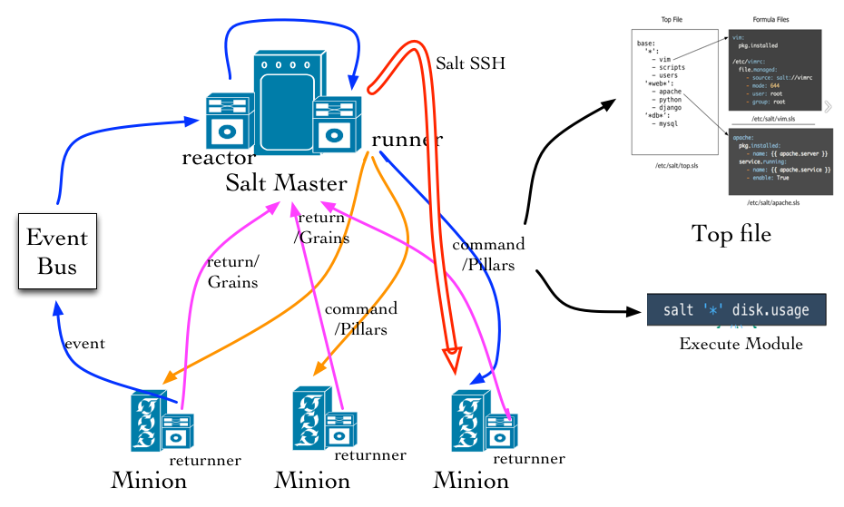

# Automation Management

## Table of Contents


- [**Introduction**](#introduction)
- [**Architecture**](#architecture)
    - [*SaltStack Key Components*](#saltstack-key-components)
    - [*Deployment Architecture*](#deployment-architecture)
- [**Bootstrap**](#bootstrap)
    - [*Installation*](#installation)
    - [*Upgrading*](#upgrading)
    - [*Common Commands*](#common-commands)
    - [*Operating Steps*](#operating-steps)
- [**Trouble Shooting**](#trouble-shooting)
- [**TODO**](#todo)

<!-- /MarkdownTOC -->
---------------------------------

## **Introduction**
[SaltStack][1] is "an automation for enterprise IT ops, event-driven data center orchestration and the most flexible configuration management for DevOps at scale." It use Jinja2 as its template engine so that all sls state file can be weritten in [jinja2 template desinging syntax][2]. The most important steps in deploying saltstack is the salt state file, which manages all the components and processes in operating servers. SaltStack assembles some basic state modules which are very useful when scripting the state file. The full list of builtin state modules can be found [here][3].

Our production deployment is based on saltstack version 2016.3.0. Installation and upgrading steps will be depited in the next chapter in detail.

---------------------------------


## **Architecture**

### ***SaltStack Key Components***
<div  align="center">    

</div>
<div align="center"> <p><b>Fig.1 SaltStack Components</b></p> </div>

> * **Salt Master**: Management Center, opening local port 4505 and 4506 in default
> * **Salt Minion**: Management client, fetching and executing commands from salt master
> * **Top file**: Main management file for matching formulas and pillars to minions
> * **Formulas**: A declarative or imperative representation of a system configuration.
> * **Pillars**: Variables stored in master and assigned to minions
> * **Grains**: Variables stored in minions and passed to master when retrieving
> * **Reactor**: Trigger reactions when events occur in your SaltStack environment
> * **Salt SSH**: Run Salt commands over SSH on systems that do not have a minions

### ***Deployment Architecture***

<div  align="center">    

</div>
<div align="center"> <p><b>Fig.1 SaltStack Deployment Architecture</b></p> </div>

In our production environment, we divide all severs into three nodegroups, including alicloud-cn, alicloud-intl, and local (Also we can call them clusters to be in accordance with ganglia naming custom). Servers in local nodegroup can directly connect salt-master's listening ports (4505 and 4506), while those in alicloud-cn and alicloud-intl nodegroups must indirectly connect to the master with the help of ssh remote tunnel, which forwards master's opening ports (4505 and 4506) to specified minions (www.123go.net.cn and dev.tpages.intl). A ssh tunnel scripts is located in tool directory of this projects. Usages info is as follows:
```shell
# Start ssh remote tunnels
sh saltmaster-tunnels.sh --start
# Stop ssh remote tunnels
sh saltmaster-tunnels.sh --stop
```

Through the ssh tunnel, servers on the clound can connect to minion www.123go.net.cn or dev.tpages.intl intranet address. The data to those two minions will then forwarded to master through data forwarding. To sum up, before applying state files or making changes to servers, remember start ssh tunnel and use "salt '*' test.ping" command to check connecting status of minions.

---------------------------------

## ***Bootstrap***

### **Installation**

- ***Install Salt***


Install SaltStack with the specified version on most of the systems, **excluding OSX and Windows**. For example, to install salt version 2015.8.8, we just type the following command.

```shell
sudo sh src/tools/scripts/bootstrp_salt.sh git v2015.8.8
```
For OSX users, install saltstack with pip or homebrew on OSX is better choice, and make sure the version matches or be later than the one installed by bootstracp script.
```shell
brew install python
pip install salt
```

- ***Install other related dependencies***

To check installation result and other uninstalled dependencies, type the following command:
```shell
salt --versions-report
```
Then use pip to install those listed as "not installed".

You should always be cautious on installing pygit2 and libgit2, since those two packages must be compatible, or in other words, versions must match. However, packages management tools can't assure that. Here we suggest installing the two from source code with both in version 0.24.0, as it has been tested in production.
```shell
# Install libgit2
git clone https://github.com/libgit2/libgit2.git -b v0.24.0
mkdir libgigt2/build && cd libgit2/build || return
cmake .. && cmake --build . --target install
ln -s /usr/local/lib/libgit2.so.24 /lib/
cd ../../ && rm -fr libgit2/
# Install pygit2
git clone https://github.com/libgit2/pygit2.git -b v0.24.0
cd pygit2 || return
python setup.py install
cd ../ && rm -fr pygit2/
```

- ***Install tools for local build***

Our project conducts some local tests before applying the changes to production for safety reason. Those tests include shell syntax check, nginx config test, and state file check. Necessary tools are required to perform such tests. To install them, type the following commands.

```shell
# Install tools with system package management tool
brew/yum/apt-get install ant shellcheck nginx autossh
```

- ***Build the first stable distribution***

Since our salt-master is run under 'dist' directory of this project, we must  build the first stable release based on our stable src files (in src directory).
```shell
ant stable
```

- ***Config salt***

Add the following environment to your system, including master and minion if you wanna use your custom config directory
```shell
export SALT_CONFIG_DIR=/path/to/your/config/dir
```

Make a symbolic link of your custom config dir to system level directory.
```shell
sudo ln -s /path/to/your/cofig/dir/* /etc/
```

### ***Upgrading***

When upgrading Salt, the master(s) should always be upgraded first. Backward compatibility for minions running newer versions of salt than their masters is not guaranteed.
If bootstrap script is used to install salt, you should also use the script to upgrade salt.
```
sudo sh tools/bootstrap_salt.sh git v2016.3.0
```

When using pip to install salt, use the following command to upgrade.
```
pip install salt --upgrade
```

Ado also you can checkout salt source code directory in github, and install it form the source yourself.
```shell
git clone https://github.com/saltstack/salt.git -b v2016.3.0
cd salt && sudo python setup.py install
```

***Remember: Always restart salt-master or salt-minions when you have made an upgrading on it.***

### ***Common Commands***
```shell
# Apply state XXX to all minions
salt '*' state.apply XXX
# Apply state XXX to specified minion, nodegroup
salt 'tpages.cn' state.apply XXX
salt -N 'alicloud-cn' state.apply XXX  # match a nodegroup
salt -G 'os@centos' state.apply XXX,YYY # match with salt grain
# Salt test before applying to see what changes will be made
salt '*' state.apply XXX test=True
# Syn all grains
salt '*' saltutil.sync_grains
```

## **Operating Steps**
- Start salt-master in debug mode so that you can check more details happened under the hood.
```shell
salt-master -l debug
```

- Start ssh tunnels.
```shell
sh dist/tools/scripts/saltmaster-tunnels.sh --start
```

- Test salt minions connection status
```shell
salt '*' test.ping
```

- Draft the state formula in src/master directory.
- Build before applying state files.

In our build config, we mainly conduct shell scripts syntax check, nginx config test, and salt state files check locally, so that everything are under control before applying to the production environment.
```
ant -v
```


- Revert changes.

If you wanna revert changes in dist directory even if the former build is successful, just run the salt.revert task with ant.
```shell
ant revert
```

- Apply the state file to target minion.

```shell
salt 'tpages.cn' state.apply nginx,repos saltenv=base
```

---------------------------------
## **Features**
### ***Nodegroup***

| Nodegroup    | Salt-masters               |Salt-minions      | Minion Address | Notes
|--------------|----------------------------|------------------|----------------|-------
|alicloud-cn   |10.168.13.25                | www.go1978.com   |                |
|alicloud-cn   |10.168.13.25                | www.123go.net.cn |                |
|alicloud-cn   |10.168.13.25                | tpages.cn        |                |
|alicloud-cn   |10.168.13.25                | app.tpages.cn    |                |
|alicloud-intl |10.45.246.58                | dev.tpages.intl  |                |
|alicloud-intl |10.45.246.58                | tpages.intl      |                |
|local         |192.168.3.167/192.168.3.82/ | homeyard         |                |
|local         |192.168.3.167/192.168.3.82/ | sinospirit       |                |
|local         |192.168.3.167/192.168.3.82/ | itserver         |                |


### ***States***


### ***Pillar***


### ***Grains***


## **Trouble Shooting**

- ***SaltReqTimeoutError on minion side. && Falied to authenticate message***

This is most likely to happen in the testing phase of a Salt deployment, when all Minion keys have already been accepted, but the framework is being tested and parameters are frequently changed in the Salt Master's configuration file(s).

The Salt Master generates a new AES key to encrypt its publications at certain events such as a Master restart or the removal of a Minion key. If you are encountering this problem of too many minions re-authing against the Master, you will need to recalibrate your setup to reduce the rate of events like a Master restart or Minion key removal (salt-key -d).

When the Master generates a new AES key, the minions aren't notified of this but will discover it on the next pub job they receive. When the Minion receives such a job it will then re-auth with the Master. Since Salt does minion-side filtering this means that all the minions will re-auth on the next command published on the master-- causing another "thundering herd". This can be avoided by setting the
```
random_reauth_delay: 60
```
in the minions configuration file to a higher value and stagger the amount of re-auth attempts. Increasing this value will of course increase the time it takes until all minions are reachable via Salt commands.

And you can also increase master worker threads (default 5), and always restart minion when you restart your master process.

- ***ERROR: Minions returned with non-zero exit code***

Delete sudo_user config in minion configuration file.

- ***Salt-minion restart loop***

Many causes can lead salt-minion into a restart loop. Remember to use salt-call instead of starting salt-minion in debug mode to locate the reason that the minion is in the loop. With the following command:
```shell
salt-call -c /usr/local/saltstack/minion/etc/salt state.apply -l debug
```
Here we got the error that "cannot import name PKCS1_OAEP", so upgrade our salt dependency, pycrypto to the newest version.

---------------------------------


## **TODO**
- [X] Deploy saltstack in Alicloud China, Alicloud Sigapore, and Local Servers
- [X] Enable users(leon, jc, jerry, nginx, loggie), groups(mgr,nginx) management
- [X] Enable system repos (remi, epel), hosts, motd namagement
- [X] Enable supervisor, gmond, sshd management
- [X] Enable nginx, hhvm, vsftp management
- [X] Enable saltstack build procedure(for nginx configs, salt state files) before applying
- [X] Enable salt-minion deployment
- [X] Enable iptables management
- [X] Custom grains deployment (shellshock)
- [ ] Enable Php-Fpm management
- [ ] Deploy Event and Reactor

  [1]: https://docs.saltstack.com/en/latest/topics/releases/2016.3.0.html
  [2]: http://jinja.pocoo.org/docs/dev/templates/
  [3]: https://docs.saltstack.com/en/latest/ref/states/all
